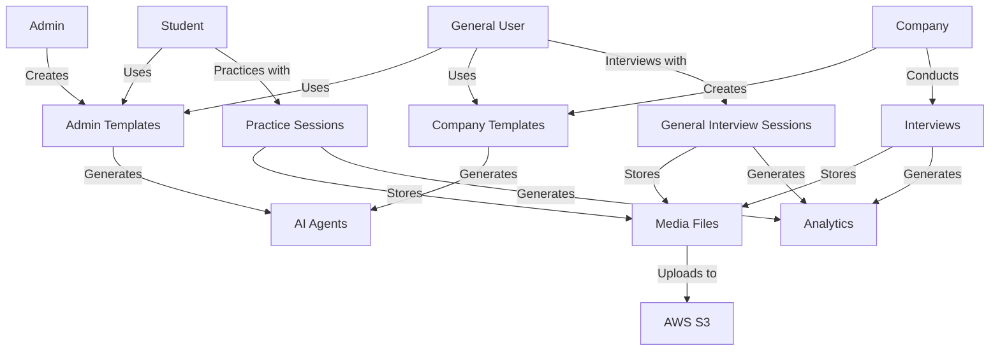

# HumaneQ-HR Database Structure Documentation

*Generated: September 26, 2025*

## 📋 Table of Contents

1. [Database Overview](#database-overview)
2. [Collections Structure](#collections-structure)
3. [Data Flow Diagram](#data-flow-diagram)
4. [API Endpoints Mapping](#api-endpoints-mapping)
5. [User Authentication System](#user-authentication-system)
6. [Interview Workflow](#interview-workflow)
7. [Template Management](#template-management)
8. [File Storage & Media](#file-storage--media)
9. [Analytics & Reporting](#analytics--reporting)
10. [Database Relationships](#database-relationships)

---

## 🗄️ Database Overview

**Database Name:** `humaneq-hr`  
**Type:** MongoDB  
**Connection:** `mongodb://localhost:27017` (Development)

### Primary Collections

- `users` - Company users and administrators
- `students` - Student accounts for practice sessions
- `generalusers` - General public users
- `templates` - Company-created interview templates
- `admin_templates` - Admin-created role-based templates
- `interviews` - Interview sessions and responses
- `practice_sessions` - Student practice sessions
- `generalinterviewsessions` - General user interview sessions
- `interviewaccess` - Access control for general users

---

## 🏗️ Collections Structure

### 1. **Users Collection** (`users`)

**Purpose:** Company users and system administrators

```typescript
interface User {
  _id: ObjectId
  email: string                    // Login email
  password: string                 // Hashed password
  role: "admin" | "company"        // User type
  name: string                     // Full name
  companyName?: string             // Company name (for company users)
  interviewQuota?: number          // Monthly interview limit
  interviewsUsed?: number          // Interviews used this month
  createdAt: Date
  updatedAt: Date
}
```

**Key Features:**

- Admin users can manage entire platform
- Company users can create templates and conduct interviews
- Quota system for interview limits

**API Endpoints:**

- `GET /api/auth/me` - Get current user info
- `POST /api/auth/login` - User login
- `POST /api/auth/signup` - User registration
- `GET /api/admin/companies` - List all companies (admin only)

---

### 2. **Students Collection** (`students`)

**Purpose:** Student accounts for practice interviews

```typescript
interface Student {
  _id: ObjectId
  email: string
  password: string
  firstName: string
  lastName: string
  university?: string
  major?: string
  graduationYear?: number
  targetRole?: string
  phoneNumber?: string
  linkedinProfile?: string
  resumeUrl?: string
  profilePicture?: string
  isEmailVerified: boolean
  practiceQuota: number            // Monthly practice limit
  practiceUsed: number             // Practice sessions used
  quotaResetDate: Date             // When quota resets
  sessions: PracticeSession[]      // Embedded practice sessions
  analytics: StudentAnalytics      // Performance metrics
  preferences: StudentPreferences   // User settings
  subscriptionTier: "free" | "premium" | "pro"
  createdAt: Date
  updatedAt: Date
}
```

**Key Features:**

- Practice interview tracking
- Analytics and progress monitoring
- Subscription tiers with different quotas
- Resume and profile management

**API Endpoints:**

- `GET /api/student/profile` - Get student profile
- `PUT /api/student/profile` - Update profile
- `GET /api/student/analytics` - Get performance analytics
- `GET /api/student/sessions` - Get practice history

---

### 3. **General Users Collection** (`generalusers`)

**Purpose:** Public users who can take interviews

```typescript
interface GeneralUser {
  _id: string
  email: string
  passwordHash: string
  firstName: string
  lastName: string
  profilePicture?: string
  resumeUrl?: string
  phoneNumber?: string
  location?: string
  subscriptionTier: 'free' | 'premium'
  interviewQuota: number           // Monthly interview limit
  interviewsUsed: number           // Interviews used
  quotaResetDate: Date
  preferences: GeneralUserPreferences
  accountStatus: 'active' | 'suspended' | 'pending'
  isEmailVerified: boolean
  createdAt: Date
  updatedAt: Date
}
```

**API Endpoints:**

- `POST /api/general/auth/signup` - Register general user
- `POST /api/general/auth/login` - Login
- `GET /api/general/templates` - Get available templates
- `GET /api/general/results` - Get interview results

---

### 4. **Templates Collection** (`templates`)

**Purpose:** Company-created interview templates

```typescript
interface Template {
  _id: ObjectId
  companyId: ObjectId             // Owner company
  title: string
  description: string
  questions: Question[]           // Interview questions
  estimatedDuration: number       // Minutes
  isActive: boolean
  agentId?: string               // ElevenLabs agent ID
  difficulty?: "beginner" | "intermediate" | "advanced"
  category?: string
  isPublic?: boolean             // Available for public use
  practiceAllowed?: boolean      // Students can practice
  createdAt: Date
  updatedAt: Date
}
```

**Question Structure:**

```typescript
interface Question {
  id: string
  type: "text" | "video" | "multiple-choice"
  question: string
  timeLimit?: number
  options?: string[]             // For multiple choice
  required: boolean
}
```

**API Endpoints:**

- `GET /api/templates` - Get company's templates
- `POST /api/templates` - Create new template
- `GET /api/practice/templates` - Get practice templates (students)

---

### 5. **Admin Templates Collection** (`admin_templates`)

**Purpose:** Admin-created role-based templates

```typescript
interface AdminTemplate {
  _id: ObjectId
  title: string
  description: string
  targetRole: "company" | "student" | "general"  // Target user type
  questions: string[]             // Array of questions
  agentPrompt?: string           // Custom AI agent prompt
  useCustomPrompt?: boolean      // Use custom vs generated prompt
  agentId?: string              // ElevenLabs agent ID
  isActive: boolean
  createdBy: string             // Admin user ID
  createdByType: "admin"
  usageCount: number            // How many times used
  createdAt: Date
  updatedAt: Date
}
```

**Key Features:**

- Role-based access control
- Custom AI agent prompts
- Dynamic or static prompt generation
- Usage tracking

**API Endpoints:**

- `GET /api/admin/templates` - Get all admin templates
- `POST /api/admin/templates` - Create admin template
- `GET /api/student/templates` - Get student role templates
- `GET /api/general/templates` - Get general role templates

---

### 6. **Interviews Collection** (`interviews`)

**Purpose:** Main interview sessions and responses

```typescript
interface Interview {
  _id: ObjectId
  companyId: ObjectId            // Conducting company
  templateId: ObjectId           // Template used
  candidateName: string
  candidateEmail: string
  uniqueLink: string            // Interview access link
  status: "pending" | "in-progress" | "completed" | "expired"
  responses: CandidateResponse[]
  score?: number
  feedback?: string
  conversationId?: string       // ElevenLabs conversation ID
  
  // Media files
  audio?: string               // Local audio backup
  audioS3?: string            // S3 audio URL (primary)
  video?: string              // Local video backup (user only)
  videoS3?: string           // S3 video URL (user only)
  videoComplete?: string      // Local complete video (with system audio)
  videoCompleteS3?: string   // S3 complete video URL
  
  transcript?: string[]       // Conversation transcript
  startedAt?: Date
  completedAt?: Date
  
  metadata?: {
    sessionType: 'practice' | 'interview' | 'demo'
    userRole: 'student' | 'company' | 'admin'
    userId: string
    quotaType: 'practiceUsed' | 'interviewsUsed'
  }
  
  // Analytics
  analysis?: InterviewAnalysis
  finalScore?: FinalScoreBreakdown
  
  createdAt: Date
  updatedAt: Date
}
```

**Response Structure:**

```typescript
interface CandidateResponse {
  questionId: string
  response: string
  videoUrl?: string
  audioUrl?: string
  duration: number
  timestamp: Date
}
```

**API Endpoints:**

- `GET /api/interviews` - Get company's interviews
- `POST /api/interviews` - Create new interview
- `GET /api/interviews/[id]` - Get specific interview
- `POST /api/interviews/[id]/video` - Upload interview recording

---

### 7. **Practice Sessions Collection** (`practice_sessions`)

**Purpose:** Student practice interview sessions

```typescript
interface PracticeSession {
  _id: ObjectId
  sessionId: string             // Unique session identifier
  studentEmail: string          // Student identifier
  templateId: ObjectId          // Template used
  templateName: string
  startedAt: Date
  completedAt?: Date
  status: "in-progress" | "completed" | "abandoned"
  responses: SessionResponse[]
  score?: number
  feedback?: string
  
  // Media files
  audioUrl?: string
  audioS3?: string
  videoUrl?: string
  videoS3?: string
  transcript?: string[]
  
  duration: number              // Session duration in seconds
  analysis?: InterviewAnalysis  // Performance analysis
  finalScore?: FinalScoreBreakdown
}
```

**API Endpoints:**

- `GET /api/practice/sessions` - Get student's sessions
- `POST /api/practice/sessions` - Create practice session
- `GET /api/practice/sessions/[sessionId]` - Get specific session

---

### 8. **General Interview Sessions Collection** (`generalinterviewsessions`)

**Purpose:** Interview sessions for general public users

```typescript
interface GeneralInterviewSession {
  _id: string
  generalUserId: string         // General user ID
  templateId: string            // Template used
  sessionId: string             // Unique session ID
  templateTitle: string
  companyName: string
  status: 'scheduled' | 'in-progress' | 'completed' | 'cancelled'
  scheduledAt?: Date
  startedAt?: Date
  completedAt?: Date
  duration: number              // In minutes
  score?: number
  feedback?: string
  interviewerNotes?: string
  recordingUrl?: string
  transcriptUrl?: string
  analysis: GeneralInterviewAnalysis
  questionsAsked: GeneralQuestionResponse[]
  createdAt: Date
  updatedAt: Date
}
```

**API Endpoints:**

- `GET /api/general/interviews` - Get user's interviews
- `POST /api/general/interviews` - Schedule interview
- `PATCH /api/general/interviews` - Update interview status

---

### 9. **Interview Access Collection** (`interviewaccess`)

**Purpose:** Control access to templates for general users

```typescript
interface InterviewAccess {
  _id: string
  generalUserId: string         // User requesting access
  templateId: string            // Template to access
  companyId: string            // Template owner
  accessType: 'public' | 'shared' | 'purchased'
  accessGrantedAt: Date
  accessExpiryAt?: Date
  isActive: boolean
  createdAt: Date
}
```

---

## 🔄 Data Flow Diagram



---

## 🔐 User Authentication System

### Authentication Flow

1. **Company Users & Admin:**
   - Login: `POST /api/auth/login`
   - JWT token stored in HTTP-only cookie
   - Middleware: `getCurrentUser()` in `/lib/auth.ts`

2. **Students:**
   - Login: `POST /api/student/auth/login`
   - JWT token in cookie
   - Middleware: `getCurrentStudent()` in `/lib/utils/studentAuth.ts`

3. **General Users:**
   - Login: `POST /api/general/auth/login`
   - JWT token management
   - Middleware: `authenticateGeneralUser()` in `/lib/utils/generalAuth.ts`

### Role-Based Access

- **Admin:** Full platform access, template management
- **Company:** Own templates, interviews, company data
- **Student:** Practice sessions, student templates
- **General:** Public templates, own interviews

---

## 📝 Interview Workflow

### 1. Template Creation

```
Admin/Company → Create Template → Generate AI Agent → Template Available
```

### 2. Interview Process

```
User → Select Template → Start Interview → AI Agent Interaction → Record Session → Generate Analytics → Complete
```

### 3. Data Storage

```
Interview → Media Recording → S3 Upload → Transcript Generation → Analysis → Database Storage
```

---

## 📊 Analytics & Reporting

### Student Analytics

- **Performance Metrics:** Scores, improvement trends
- **Session Data:** Duration, completion rates
- **Skill Assessment:** Communication, technical skills
- **Progress Tracking:** Streak days, preferred times

### Company Analytics

- **Interview Statistics:** Completion rates, scores
- **Template Performance:** Usage statistics
- **Candidate Insights:** Response quality, assessment metrics

### Admin Analytics

- **Platform Usage:** User registrations, session counts
- **Template Analytics:** Most used templates, performance
- **System Metrics:** Database usage, API performance

---

## 🔗 Database Relationships

### Primary Relationships

1. **Users → Templates** (1:N)
   - Company users own multiple templates

2. **Templates → Interviews** (1:N)
   - Templates used in multiple interviews

3. **Students → Practice Sessions** (1:N)
   - Students have multiple practice sessions

4. **Templates → AI Agents** (1:1)
   - Each template has one AI agent

5. **Interviews → Media Files** (1:N)
   - Multiple media files per interview

### Access Control

1. **Admin Templates → User Roles**
   - `targetRole` field controls visibility

2. **Company Templates → Public Access**
   - `isPublic` flag allows general user access

3. **General Users → Template Access**
   - `interviewaccess` collection controls permissions

---

## 📁 File & Media Management

### Storage Strategy

- **Primary:** AWS S3 bucket
- **Backup:** Local file system
- **Types:** Audio, Video, Complete recordings

### File Naming Convention

```
interview_[interviewId]_[timestamp].[extension]
practice_[sessionId]_[timestamp].[extension]
conv_[conversationId].mp3
```

### API Endpoints

- `POST /api/interviews/[id]/video` - Upload interview recording
- `GET /api/interviews/[id]/signed-url` - Get S3 signed URL
- `POST /api/practice/[sessionId]/video` - Upload practice recording

---

## 🛠️ Scripts & Management Tools

### Database Management

- **Seed Script:** `/scripts/seed-database.ts`
  - Creates demo users, templates, interviews
  - Initializes admin accounts

### Template Management

- **Check Templates:** `/scripts/check-templates.js`
  - Validates admin templates
  - Reports agent status

- **Agent Creation:** `/scripts/add-agents-to-templates.js`
  - Creates ElevenLabs agents for templates
  - Dynamic prompt generation

- **Agent Testing:** `/scripts/test-elevenlabs-agents.py`
  - Tests agent functionality
  - Validates ElevenLabs integration

---

## 📱 Frontend Integration

### Key Pages & Components

1. **Admin Panel:**
   - `/admin/templates` - Template management
   - `/admin/companies` - Company management
   - Components: `CreateTemplateDialog`, `AdminLayout`

2. **Company Dashboard:**
   - `/company/templates` - Template creation/management
   - `/company/interviews` - Interview management
   - `/company/dashboard` - Main dashboard

3. **Student Portal:**
   - `/student/practice` - Practice sessions
   - `/student/analytics` - Performance tracking
   - `/student/profile` - Profile management

4. **Interview Interface:**
   - `/interview/[id]` - Live interview interface
   - Components: `VoiceReactiveVisual`, Recording hooks

---

## 🔧 Development Setup

### Environment Variables

```env
MONGODB_URI=mongodb://localhost:27017
XI_API_KEY=your_elevenlabs_api_key
AWS_S3_BUCKET=your-s3-bucket
JWT_SECRET=your-jwt-secret
```

### Database Connection

- **File:** `/lib/mongodb.ts`
- **Function:** `getDatabase()`
- **Connection Pool:** Managed by MongoDB driver

### Key Utilities

- **Authentication:** `/lib/auth.ts`
- **Database:** `/lib/mongodb.ts`
- **Models:** `/lib/models/*.ts`
- **Utils:** `/lib/utils/*.ts`

---

## 📋 Summary

The HumaneQ-HR database architecture supports a comprehensive interview platform with:

- **Multi-user system** (Admin, Company, Student, General)
- **Role-based templates** with AI agent integration
- **Complete interview workflow** from creation to analytics
- **Media storage** with S3 integration
- **Real-time analytics** and progress tracking
- **Scalable architecture** with MongoDB collections

The system is designed for scalability, maintainability, and comprehensive interview management across different user types and use cases.

---

*Last Updated: September 26, 2025*
*Database: MongoDB - Collection: humaneq-hr*
*Version: 2.0*
