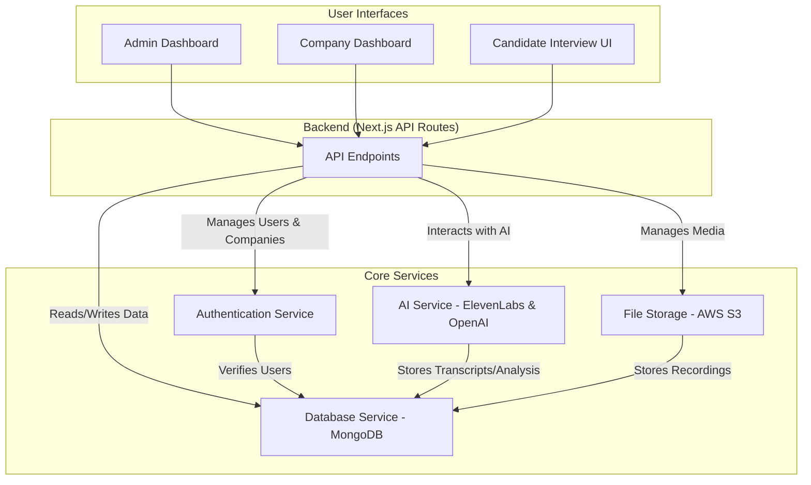
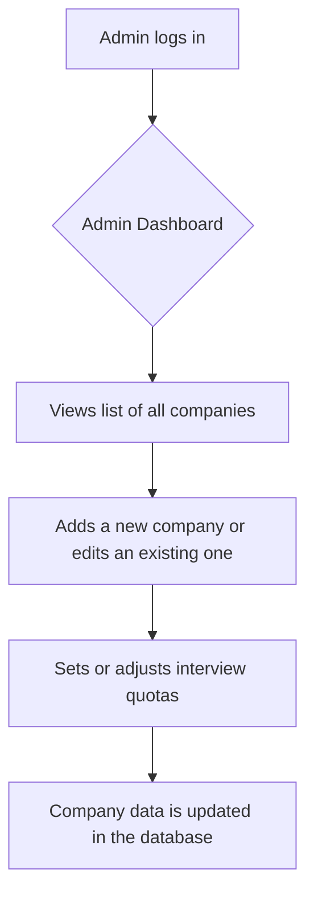
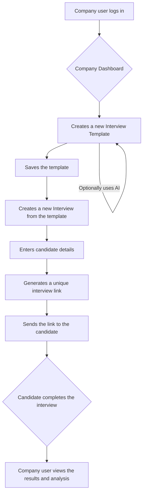
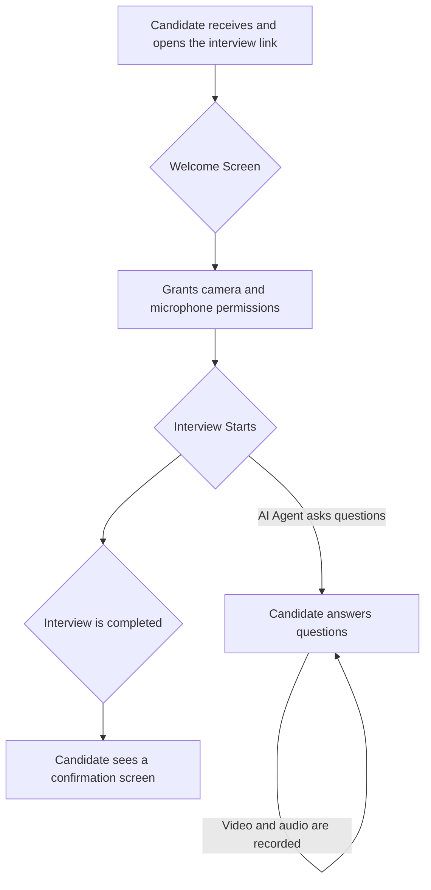

# HumaneQ HR - Application Documentation

## 1. Overview

HumaneQ HR is a sophisticated, AI-powered interview platform designed to streamline the hiring process for modern HR teams. It provides a suite of tools for administrators, companies, and candidates, ensuring a seamless and efficient interview experience from start to finish.

The platform leverages cutting-edge AI technologies, including **ElevenLabs** for conversational AI agents and **OpenAI (GPT-4)** for intelligent analysis of interview responses.

### KeyFeatures :

***Role-Based Access Control:** Separate, secure dashboards for Admins and Companies.
***AI-Powered Interviews:** Dynamic, conversational interviews conducted by AI agents.
***Customizable Templates:** Companies can create and manage their own interview templates.
***In-Depth Analytics:** Comprehensive analysis of candidate performance, including both quantitative and qualitative metrics.
***Cloud Media Storage:** Secure storage of interview recordings (audio and video) on AWS S3.
***Intuitive User Experience:** A modern, responsive interface for all user roles.

## 2. System Architecture

The application is built on a modern web stack, primarily using Next.js for both the frontend and backend.

***Frontend:** React, Next.js, TypeScript, Tailwind CSS, Shadcn UI
***Backend:** Next.js API Routes, Node.js
***Database:** MongoDB
***AI Services:**
    ***ElevenLabs:** For conversational AI agents.
    ***OpenAI (GPT-4):** For interview question generation and response analysis.
***Cloud Storage:** AWS S3 for audio and video recordings.
***3D Visuals:** Three.js for real-time voice-reactive visualizations during interviews.

### High-Level Architecture Diagram

## 3. User Roles & Workflows

### 3.1. Admin

The Admin role is responsible for the overall management of the platform.

**Workflow: Managing Companies**

### 3.2. Company

The Company role represents a hiring organization. They are the primary users of the platform's core features.

**Workflow: Creating and Conducting an Interview**

### 3.3. Candidate

The Candidate is the individual being interviewed. They interact with the platform through a unique, secure link.

**Workflow: Taking an Interview**

## 4. Core Components & Functionality

### 4.1. Authentication (`/lib/auth.ts`)

***Method:** JSON Web Tokens (JWT) stored in secure, HTTP-only cookies.
***Password Hashing:** `bcryptjs` is used to securely hash and verify passwords.
***Roles:** The JWT payload includes the user's role (`admin` or `company`), which is used to protect routes and authorize actions.

### 4.2. Database Models (`/lib/models/`)

***User:** Stores information about both Admin and Company users. Company users have additional fields for `companyName`, `interviewQuota`, and `interviewsUsed`.
***Template:** Defines the structure of an interview, including the title, description, and a list of questions. Each template is associated with a company and an ElevenLabs `agentId`.
***Interview:** Represents a single interview instance. It links a `company`, a `template`, and a `candidate`. It also stores the interview `status`, `responses`, `scores`, and links to the recorded media.

### 4.3. AI Integration

#### ElevenLabs (`/app/api/interviews/[id]/signed-url/route.ts`)

***Conversational AI:** ElevenLabs agents are used to conduct the interviews. An agent is created for each interview template, with a system prompt that guides the conversation.
***Signed URLs:** To initiate a conversation, the backend fetches a signed URL from ElevenLabs, which the frontend uses to connect to the AI agent.

#### OpenAI (`/app/api/templates/generate-questions/route.ts`, `/app/api/interviews/[id]/route.ts`)

***Question Generation:** Companies can use OpenAI (GPT-4) to automatically generate interview questions based on a prompt.
***Transcript Analysis:** After an interview is completed, the transcript is sent to GPT-4 for analysis. The AI provides scores for metrics like `correctness`, `relevance`, and `confidence`, and gives a final hiring recommendation.

### 4.4. Media Handling

***Recording:** The candidate's video and audio are recorded in the browser using the `MediaRecorder` API.
***Storage (`/lib/utils/s3.ts`):**
    *Recordings are uploaded to an AWS S3 bucket for persistent, secure storage.
    *A local copy is also saved in the `/uploads` directory as a backup.
***Playback:** The recorded video is available for playback in the interview results view.

### 4.5. 3D Voice Visualization (`/components/VoiceReactiveVisual.tsx`)

***Technology:** Three.js is used to create a real-time, voice-reactive animation that plays while the AI agent is speaking.
***Purpose:** This provides a dynamic and engaging visual experience for the candidate, making the AI interaction feel more "alive."
***Implementation:** The component analyzes the frequency and volume data of the incoming audio stream from ElevenLabs to drive the animation of a 3D sphere.

## 5. Scripts (`/scripts/`)

The `scripts` directory contains several utility scripts for managing the application and its data.

***`seed-database.js`:** A script to populate the MongoDB database with initial data, including a default admin user, demo companies, templates, and interviews. This is useful for setting up a development or demo environment.
***`add-agents-to-templates.js`:** A utility to create ElevenLabs agents for any existing templates in the database that do not yet have one.
***`check-templates.js`:** A simple script to list all templates in the database and verify their properties.
***`test-elevenlabs-agents.py`:** A Python script to test the connection to the ElevenLabs API and verify that the created agents are functional.

This documentation provides a comprehensive overview of the HumaneQ HR application. For more detailed information, please refer to the source code and inline comments.
